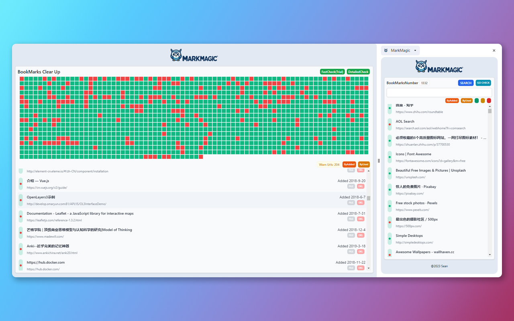

# 🔖 MarkMagic Browser Extension

Introducing MarkMagic, your ultimate tool for managing digital bookmarks with ease. This browser add-on aims to streamline how you organize and interact with bookmarks. With MarkMagic, you can seamlessly verify live bookmark links, secure the data they hold and smartly arrange them by frequency and time of addition. This handy tool features index searching, mass removal, and orderly sorting features just a few clicks away. Exciting updates forthcoming include detection of redundant bookmarks, purging of barren bookmark folders, and refined search velocities. A future upgrade entails AI-powered semantic analysis that transcends basic keyword lookup. Developed for users desiring to sift and categorize data reflecting their Xi habits, MarkMagic casts itself as your personalized, automatic bookmark-management system for an extraordinary browsing affair.

## 🧠 Key Elements

- **Intuitive Oversight**: Manually inspect bookmark validity ensuring your links are current.
- **Active content moderation**: Assure your bookmarked content consistent with your expected standards.
- **Strategic organization**: Order bookmarks by date added or latest interaction period.
- **One-Touch Navigation**: Instant bookmark access with straightforward, one-tap erasing and storing features.
- **Forward-Thinking Modifications**:
  - Locate and fix repetitive link issues and identify barren directories.
  - Accelerate the pace at which bookmarks are scanned.
  - Leverage AI insights for dimensional articulation alongside text probing.
  - Autonomous bookmarking strings and handling.

|||
|---|---|

## 🔨 How To Install

Installing MarkMagic, your go-to browser extension, is a breeze whether you're using Chrome or Edge. This handy tool is just a few clicks away from enhancing your browsing experience with its magic. To get started, simply follow the links provided below to navigate to the respective web store for your browser.

For Chrome users, find MarkMagic on the Chrome Web Store by clicking [here](https://chromewebstore.google.com/detail/markmagic/efpddbdnjokoakknlfljkcndcaonilpg).

Edge enthusiasts can locate the extension on the Microsoft Edge Addons page by clicking [here](https://microsoftedge.microsoft.com/addons/detail/markmagic/chdnocboifbdehfnghinbjjcnklgdafm).

Once you're on the store page, click the "Add to Browser" button. MarkMagic willbe ready to cast its spell on your internet adventures!

## 📘 How To Use

- Hit the MarkMagic button within the browser's navigational panel to launch.
- Apply the provided video index to pinpoint your bookmark with swiftness.
- Oversee your listing includes status checks, elimination, or file compression options.
- Employ intuitive structuring to finetune your bookmark assembler.

## 👨‍💻 Info for Developers

This extension enjoys the simplified development and eye-catching design enabled by React, Vite, and Tailwind CSS.

MarkMagic sprung from the vision of dedicated developers rich with an ardent passion for open-source philosophy and cutting-edge innovations. Our mission is deliverance of software products prompt to use, geared at streamlining everyday net surfing practices, thus enriching user efficiency.

## 🙌 Guidelines for Contributing

Eager to assist in MarkMagic’s growth? Enthusiasm is welcome! Employ these strategies:

1. Disseminate the project into your own GitHub library.
2. Forge a distinct development-focused local division.
3. Confidently process your progressions and deploy onto your silhouette.
4. Instigate a Request for Analysis, conveying alterations devised.

## 👂 Feedback & Assistance

Transaction difficulties or looking to acquire as MarkMagic evolves? Approach through:

- [GitHub Problems](https://github.com/IAMSHENSH/g-mark-magic-ext/issues)
- Email: isshshen gmail.com

Esteeming customer input, we pledge adherence to refinement of our outputs.

We rejoice in your MarkMagic selection. Wishing you a delightful indulgence!
